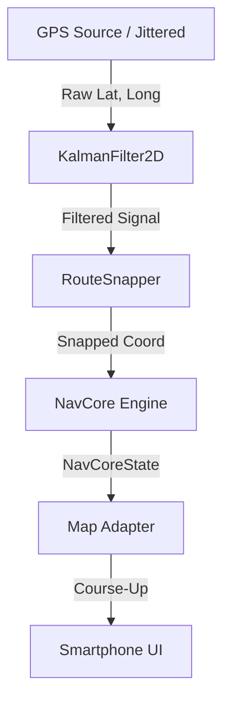

# NavCore SDK - Examples Hub

Welcome to the **NavCore SDK Examples Hub**! This directory contains a comprehensive set of interactive examples designed to demonstrate the power of the `@ingissa/navcore-sdk` navigation engine. 

## 🚀 Premium Web Demos
Examples **04 (MapLibre)** and **05 (Leaflet)** have been upgraded to premium, mobile-first interactive demos.

- **Smartphone Device Frame**: Experience the SDK as it would appear on a real mobile device.
- **Course-Up Navigation**: Intelligent camera management that keeps the vehicle heading "Top" (available in both MapLibre and Leaflet).
- **Collapsible HUD**: Modern glassmorphism UI banner that can be toggled to maximize map visibility.
- **SDK Engineering View**: Toggle **Route Snapping** and **GPS Smoothing** in real-time to see the "before and after" impact of the core engine.
- **Synthetic GPS Noise**: Simulated 15m jitter shows how the SDK handles real-world noisy signals.

---

## 🛠️ Installation & Setup

Before running any web-based example, ensure all dependencies are installed:

```bash
# In this directory (apps/navcore/examples)
npm install
```

---

## 💻 Running the Examples

### **Web-Based Interactive Demos (04, 05)**

These use **Vite** for a fast, modern development experience.

```bash
# Start the dev server
npm run dev

# Access the demos:
# MapLibre: http://localhost:5173/04-maplibre-web/index.html
# Leaflet:  http://localhost:5173/05-leaflet-web/index.html
```

### **CLI & Headless Examples (01 - 03, 07 - 11)**

Node-based examples can be run directly using `tsx`:

```bash
# Basic navigation state logs
npx tsx 01-basic-navigation/index.ts

# Offline geofencing engine
npx tsx 09-geofencing/index.ts

# Headless performance testing
npx tsx 11-headless-testing/index.ts
```

---

## 📊 Compatibility Matrix

| Example | Title | Renderer | Key Features |
|---------|-------|----------|--------------|
| **04** | MapLibre Web | MapLibre GL | 3D Pitch, Built-in Rotation, Vector Tiles |
| **05** | Leaflet Web | Leaflet.js | CSS Rotation, Raster Tiles, Lightweight |
| **01** | Basic Nav | Headless | Core Snapping Logic |
| **08** | ETA Engine | Headless | Predictive ETAs |
| **09** | Geofencing | Headless | Offline Zone Detection |

---

## 🏗️ Architecture

Below is the standard premium pipeline utilized across both the web visualizers and the React Native suite:


