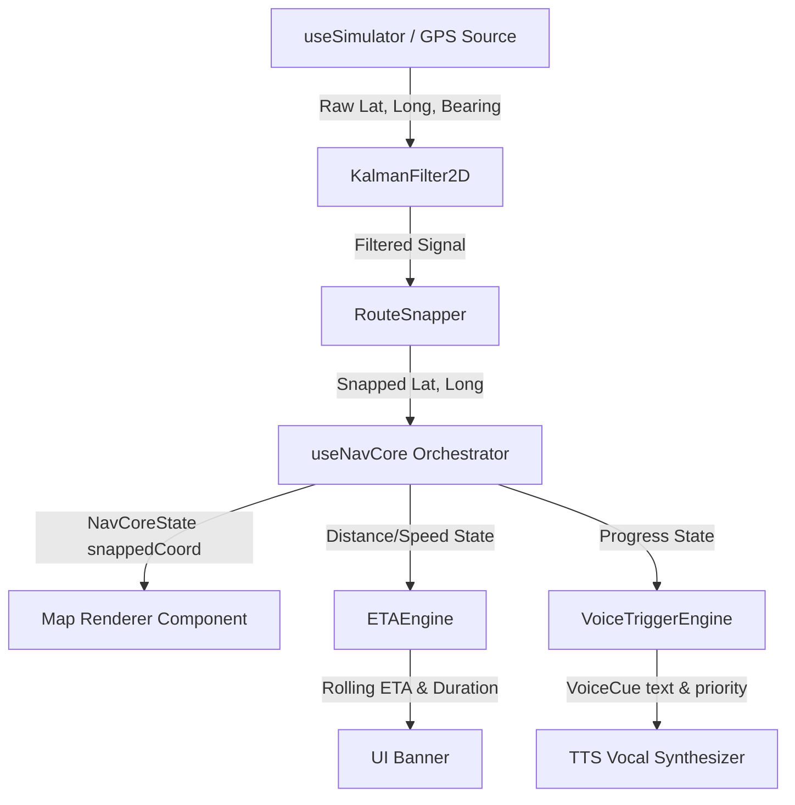

# NavCore SDK — Examples Hub

Welcome to the **NavCore SDK Examples Hub**! This directory contains a comprehensive set of examples designed to demonstrate the versatility of the `@ingissa/navcore-sdk` navigation engine. 

The examples are split into two categories:
1. **Standalone CLI & Browser Demos (01 - 11)**: Pure TypeScript/Node files for offline core utility testing, rapid CLI verification, and static HTML browser visualizers.
2. **Mobile Expo Complete Navigation Suite (12)**: A production-quality React Native navigation app demonstrating four map renderers (Leaflet, Google Maps, Mapbox, and MapLibre) running off a single unified navigation state and simulated GPS engine.

---

## 🗺️ Compatibility Matrix

### Standalone Demos (01 - 11)

| Example | Title | Key Features Demonstrated | Network / API Dependency |
|---------|-------|---------------------------|--------------------------|
| **01** | Basic Navigation | Standard snapping & route progress updates | ✅ OSRM (free public API) |
| **02** | Custom Route Builder | `CustomRouteBuilder`, GPX, and GeoJSON export | ✅ OSRM (free public API) |
| **03** | Instruction Editor | `InstructionEditor` fluent custom turn additions | ✅ OSRM (free public API) |
| **04** | MapLibre Web | HTML generation + `MapLibreAdapter` browser camera | ✅ OSRM (free public API) |
| **05** | Leaflet Web | HTML generation + `LeafletAdapter` browser tiles | ✅ OSRM (free public API) |
| **06** | Directions Providers | Comparative OSRM vs. Valhalla vs. OpenRouteService | ✅ All three providers |
| **07** | Voice Triggers | Standalone `VoiceTriggerEngine` priority vocal queues | ✅ OSRM (free public API) |
| **08** | ETA Engine | Standalone `ETAEngine` rolling average speed metrics | ✅ OSRM (free public API) |
| **09** | Geofencing | Standalone offline `GeofencingEngine` zones | ❌ None (100% Offline) |
| **10** | Parallel Road Snapping | `ParallelRoadResolver` U-turn scoring and protection | ❌ None (100% Offline) |
| **11** | Headless Testing | CI/CD testing pipeline with programmatic mocks | ✅ OSRM (free public API) |

### Mobile Expo Suite (12)

| Variant Screen | Map Renderer Library | Directions Provider | Works in Expo Go | Needs Key? | Setup Complexity |
|----------------|----------------------|---------------------|------------------|------------|------------------|
| **Leaflet** | Leaflet.js inside WebView | `OSRMDirectionsProvider` | ✅ Yes | ❌ None | 🟢 Low (None) |
| **Google** | `react-native-maps` | `OSRMDirectionsProvider` | ⚠️ Partial\* | ✅ Google Maps | 🟡 Medium |
| **Mapbox** | `@rnmapbox/maps` | `MapboxDirections` | 🔧 Dev Build | ✅ Mapbox Token | 🔴 High |
| **MapLibre** | `@maplibre/maplibre` | `ValhallaDirectionsProvider` | 🔧 Dev Build | ❌ None | 🔴 High |

> \* Google Maps renders tiles in Expo Go only if Google Play Services is available on the emulator or device **and** a valid Maps API key is configured.

---

## 🏗️ Architecture & Data Flow

Below is the standard premium pipeline utilized across both the headless test frameworks and the React Native screens. A synthetic or live GPS signal is smoothed, snapped to a route, and fed into individual Pro engines to generate state variables:



---

## 🚀 Installation & Prerequisites

From the monorepo root directory, install all required dependencies (peer dependencies are handled via the legacy flag for mobile modules):

```bash
# Clean install all packages
npm install --legacy-peer-deps
```

---

## 💻 Running Standalone Examples (01 - 11)

All standalone Node examples use direct TypeScript execution. Run them with `npx tsx`:

```bash
# Run basic snapping output
npx tsx examples/01-basic-navigation/index.ts

# Export custom routes to GPX
npx tsx examples/02-custom-route-builder/index.ts

# Test fluent instruction builder
npx tsx examples/03-instruction-editor/index.ts

# Generate static HTML visualizers
npx tsx examples/04-maplibre-web/index.ts > public/maplibre.html
npx tsx examples/05-leaflet-web/index.ts  > public/leaflet.html

# Run offline engines
npx tsx examples/09-geofencing/index.ts
npx tsx examples/10-parallel-road-resolver/index.ts
```

---

## 📱 Mobile Examples: Expo Complete Navigation (12)

The `12-expo-complete-navigation` project is a fully-fledged Expo application containing four mobile screens:
- `leaflet`: Leaflet.js map layer within a webview wrapper. **No native setups required!**
- `google`: Standard Google Maps using standard native hooks.
- `mapbox`: Premium vector-tile Mapbox rendering.
- `maplibre`: Fully open-source MapLibre vector maps rendering.

### Switching Active Screens
To change which map screen is running in your active mobile simulator, modify the root `App.tsx` file inside the workspace:

```tsx
import LeafletExample from './packages/navcore-sdk/examples/12-expo-complete-navigation/leaflet/index';
import GoogleExample  from './packages/navcore-sdk/examples/12-expo-complete-navigation/google/index';
import MapboxExample  from './packages/navcore-sdk/examples/12-expo-complete-navigation/mapbox/index';
import MapLibreExample from './packages/navcore-sdk/examples/12-expo-complete-navigation/maplibre/index';

export default function App() {
    return <LeafletExample />;   // ← Swap this to render a different map variant
    // return <GoogleExample />;
    // return <MapboxExample />;
    // return <MapLibreExample />;
}
```

---

## 🔧 Environment Variables Config (`.env.local`)

To run the full suite of mobile examples, copy or create a `.env.local` file in the root workspace directory with the following variables:

```bash
# ── MAPBOX CONFIGURATION ──────────────────────────────────────────────────────
# Public access token for runtime tile rendering
EXPO_PUBLIC_MAPBOX_ACCESS_TOKEN=pk.your_mapbox_public_token_here

# Secret access token used ONLY during gradle/cocoapod download phase
RNMAPBOX_MAPS_DOWNLOAD_TOKEN=sk.your_mapbox_secret_download_token_here

# ── GOOGLE MAPS CONFIGURATION ────────────────────────────────────────────────
# API key for maps SDK
EXPO_PUBLIC_GOOGLE_MAPS_API_KEY=AIzaSyYourGoogleMapsApiKeyHere

# ── VALHALLA CONFIGURATION ───────────────────────────────────────────────────
# Optional self-hosted Valhalla URL. Defaults to OpenStreetMap public instance if empty.
EXPO_PUBLIC_VALHALLA_URL=http://localhost:8002
```

> [!CAUTION]
> Never commit `.env.local` containing private keys or secret keys to version control. It is already added to `.gitignore`.

---

## 🛠️ Detailed Mobile Variant Setup Guides

### 1. Leaflet (Expo Go — 🟢 Out of the Box)
Uses Leaflet CDN inside a standard Expo `WebView`.
- **API Keys**: None required.
- **Directions Backend**: Casablanca Medina Loop from the public OSRM API.
- **Run command**:
  ```bash
  npx expo start
  # Scan QR with Expo Go on your mobile or hit 'a' / 'i'
  ```

### 2. Google Maps (Expo Go — 🟡 Key Required)
Uses `react-native-maps` to draw native platform mapping.
- **API Keys**: Requires a Google Maps API Key with **Maps SDK for Android** and **Maps SDK for iOS** enabled in the [Google Cloud Console](https://console.cloud.google.com/).
- **Setup**:
  1. Add `EXPO_PUBLIC_GOOGLE_MAPS_API_KEY` to `.env.local`.
  2. Launch via `npx expo start`.
- **Important**: Your emulator must have **Google Play Services** installed. Use a **Google Play Store** system image in Android Studio.

### 3. Mapbox (Development Build — 🔴 Native Linking)
Uses the high-performance `@rnmapbox/maps` rendering engine.
- **API Keys**: Mapbox Public token (`pk.*`) and Secret download token (`sk.*`) are required.
- **Setup**:
  1. Register the tokens in your `.env.local`.
  2. Run `npx expo prebuild` to inject native Gradle hooks.
  3. Compile and build:
     ```bash
     npx expo run:android
     # or
     npx expo run:ios
     ```

### 4. MapLibre (Development Build — 🔴 Native Linking)
Uses `@maplibre/maplibre-react-native` for a 100% open-source vector map solution.
- **API Keys**: None required!
- **Directions Backend**: Uses Valhalla (`ValhallaDirectionsProvider`).
- **Setup**:
  1. Run `npx expo prebuild` to configure Android/iOS projects.
  2. Compile and launch:
     ```bash
     npx expo run:android
     ```
  3. Optionally spin up a local Valhalla routing container:
     ```bash
     docker run -p 8002:8002 ghcr.io/valhalla/valhalla:latest
     ```

---

## ⚡ Metro Symlinks & Instant Refresh

A standard monorepo structure links packages in node_modules, requiring recompilation on every edit. We bypass this limitation completely.
The root `metro.config.js` is customized with a custom resolver that redirects `@ingissa/navcore-*` imports directly to their local TypeScript source files:

```javascript
// metro.config.js excerpt
config.resolver.resolveRequest = (context, moduleName, platform) => {
  if (moduleName.startsWith('@ingissa/navcore-')) {
    // Re-route directly to packages/navcore-sdk/packages/[pkg]/src/index.ts
    return { filePath: resolvedTsPath, type: 'sourceFile' };
  }
  return context.resolveRequest(context, moduleName, platform);
};
```
This guarantees **instant hot reloading** in the mobile emulator whenever you save a change inside the SDK!

---

## 🐛 Troubleshooting Directory

| Symptom | Probable Cause | Actionable Solution |
|---------|----------------|---------------------|
| **Blank map on Google Maps** | Play Services or API key missing | Verify `EXPO_PUBLIC_GOOGLE_MAPS_API_KEY` is set and emulator has Google Play Store installed. |
| **`Unable to resolve module @ingissa/navcore-*`** | Cache stale or config missing | Clean Expo's bundler cache: run `npx expo start --clear`. |
| **`Mapbox Native Module is not linked`** | Running in standard Expo Go | Expo Go does not contain Mapbox binaries. Compile a custom client using `npx expo run:android`. |
| **Insufficient storage during prebuild** | Emulator drive full | Wipe emulator data in Android Studio Device Manager under options. |
| **Valhalla server is unreachable** | Rate limit or server offline | Set `EXPO_PUBLIC_VALHALLA_URL` to point to a local self-hosted Valhalla container. |
| **TTS/Voice Cues are silent** | Navigation is in standby | Hit the **▶ START** simulation button in the app HUD, and ensure simulator coordinates advance close to a waypoint. |
