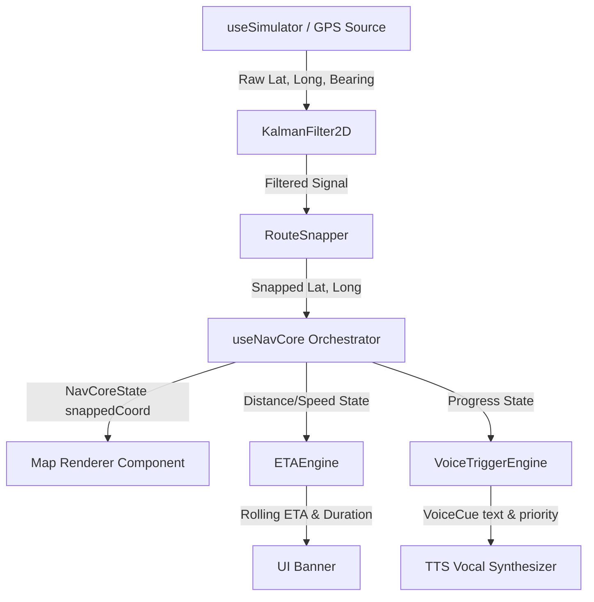

# NavCore SDK — Examples Hub

Welcome to the **NavCore SDK Examples Hub**! This directory contains a comprehensive set of examples designed to demonstrate the versatility of the `@ingissa/navcore-sdk` navigation engine. 

The examples are split into one category:
1. **Standalone CLI & Browser Demos (01 - 11)**: Pure TypeScript/Node files for offline core utility testing, rapid CLI verification, and static HTML browser visualizers.

---

## 🗺️ Compatibility Matrix

### Standalone Demos (01 - 11)

| Example | Title | Key Features Demonstrated | Network / API Dependency |
|---------|-------|---------------------------|--------------------------|
| **01** | Basic Navigation | Standard snapping & route progress updates | ✅ OSRM (free public API) |
| **02** | Custom Route Builder | `CustomRouteBuilder`, GPX, and GeoJSON export | ✅ OSRM (free public API) |
| **03** | Instruction Editor | `InstructionEditor` fluent custom turn additions | ✅ OSRM (free public API) |
| **04** | MapLibre Web | HTML generation + `MapLibreAdapter` browser camera | ✅ OSRM (free public API) |
| **05** | Leaflet Web | HTML generation + `LeafletAdapter` browser tiles | ✅ OSRM (free public API) |
| **06** | Directions Providers | Comparative OSRM vs. Valhalla vs. OpenRouteService | ✅ All three providers |
| **07** | Voice Triggers | Standalone `VoiceTriggerEngine` priority vocal queues | ✅ OSRM (free public API) |
| **08** | ETA Engine | Standalone `ETAEngine` rolling average speed metrics | ✅ OSRM (free public API) |
| **09** | Geofencing | Standalone offline `GeofencingEngine` zones | ❌ None (100% Offline) |
| **10** | Parallel Road Snapping | `ParallelRoadResolver` U-turn scoring and protection | ❌ None (100% Offline) |
| **11** | Headless Testing | CI/CD testing pipeline with programmatic mocks | ✅ OSRM (free public API) |


> \* Google Maps renders tiles in Expo Go only if Google Play Services is available on the emulator or device **and** a valid Maps API key is configured.

---

## 🏗️ Architecture & Data Flow

Below is the standard premium pipeline utilized across both the headless test frameworks and the React Native screens. A synthetic or live GPS signal is smoothed, snapped to a route, and fed into individual Pro engines to generate state variables:



---

## 🚀 Installation & Prerequisites

From the monorepo root directory, install all required dependencies (peer dependencies are handled via the legacy flag for mobile modules):

```bash
# Clean install all packages
npm install --legacy-peer-deps
```

---

## 💻 Running Standalone Examples (01 - 11)

All standalone Node examples use direct TypeScript execution. Run them with `npx tsx`:

```bash
# Run basic snapping output
npx tsx examples/01-basic-navigation/index.ts

# Export custom routes to GPX
npx tsx examples/02-custom-route-builder/index.ts

# Test fluent instruction builder
npx tsx examples/03-instruction-editor/index.ts

# Generate static HTML visualizers
npx tsx examples/04-maplibre-web/index.ts > public/maplibre.html
npx tsx examples/05-leaflet-web/index.ts  > public/leaflet.html

# Run offline engines
npx tsx examples/09-geofencing/index.ts
npx tsx examples/10-parallel-road-resolver/index.ts
```

---


---

## ⚡ Metro Symlinks & Instant Refresh

A standard monorepo structure links packages in node_modules, requiring recompilation on every edit. We bypass this limitation completely.
The root `metro.config.js` is customized with a custom resolver that redirects `@ingissa/navcore-*` imports directly to their local TypeScript source files:

```javascript
// metro.config.js excerpt
config.resolver.resolveRequest = (context, moduleName, platform) => {
  if (moduleName.startsWith('@ingissa/navcore-')) {
    // Re-route directly to packages/navcore-sdk/packages/[pkg]/src/index.ts
    return { filePath: resolvedTsPath, type: 'sourceFile' };
  }
  return context.resolveRequest(context, moduleName, platform);
};
```
This guarantees **instant hot reloading** in the mobile emulator whenever you save a change inside the SDK!

---

## 🐛 Troubleshooting Directory

| Symptom | Probable Cause | Actionable Solution |
|---------|----------------|---------------------|
| **Blank map on Google Maps** | Play Services or API key missing | Verify `EXPO_PUBLIC_GOOGLE_MAPS_API_KEY` is set and emulator has Google Play Store installed. |
| **`Unable to resolve module @ingissa/navcore-*`** | Cache stale or config missing | Clean Expo's bundler cache: run `npx expo start --clear`. |
| **`Mapbox Native Module is not linked`** | Running in standard Expo Go | Expo Go does not contain Mapbox binaries. Compile a custom client using `npx expo run:android`. |
| **Insufficient storage during prebuild** | Emulator drive full | Wipe emulator data in Android Studio Device Manager under options. |
| **Valhalla server is unreachable** | Rate limit or server offline | Set `EXPO_PUBLIC_VALHALLA_URL` to point to a local self-hosted Valhalla container. |
| **TTS/Voice Cues are silent** | Navigation is in standby | Hit the **▶ START** simulation button in the app HUD, and ensure simulator coordinates advance close to a waypoint. |
