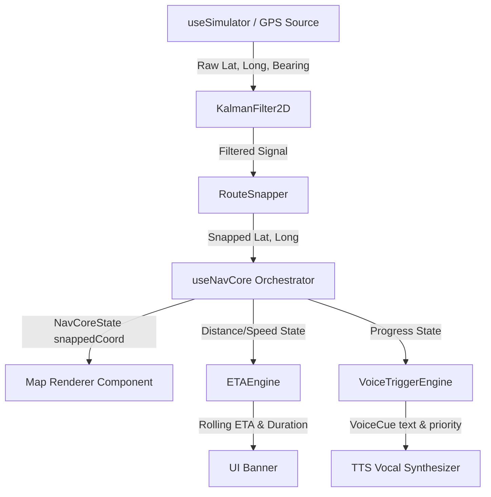

# NavCore SDK - Examples Hub

Welcome to the **NavCore SDK Examples Hub**! This directory contains a comprehensive set of examples designed to demonstrate the versatility of the `@ingissa/navcore-sdk` navigation engine. 

The examples are split into two categories:
1. **Standalone CLI & Browser Demos (01 - 11)**: Pure TypeScript/Node files for offline core utility testing, rapid CLI verification, and static HTML browser visualizers.
2. **Mobile Expo Complete Navigation Suite (12)**: A production-quality React Native navigation app demonstrating four map renderers (Leaflet, Google Maps, Mapbox, and MapLibre) running off a single unified navigation state and simulated GPS engine.

---

##     Compatibility Matrix

### Standalone Demos (01 - 11)

| Example | Title | Key Features Demonstrated | Network / API Dependency |
|---------|-------|---------------------------|--------------------------|
| **01** | Basic Navigation | Standard snapping & route progress updates |   OSRM (free public API) |
| **02** | Custom Route Builder | `CustomRouteBuilder`, GPX, and GeoJSON export |   OSRM (free public API) |
| **03** | Instruction Editor | `InstructionEditor` fluent custom turn additions |   OSRM (free public API) |
| **04** | MapLibre Web | HTML generation + `MapLibreAdapter` browser camera |   OSRM (free public API) |
| **05** | Leaflet Web | HTML generation + `LeafletAdapter` browser tiles |   OSRM (free public API) |
| **06** | Directions Providers | Comparative OSRM vs. Valhalla vs. OpenRouteService |   All three providers |
| **07** | Voice Triggers | Standalone `VoiceTriggerEngine` priority vocal queues |   OSRM (free public API) |
| **08** | ETA Engine | Standalone `ETAEngine` rolling average speed metrics |   OSRM (free public API) |
| **09** | Geofencing | Standalone offline `GeofencingEngine` zones |   None (100% Offline) |
| **10** | Parallel Road Snapping | `ParallelRoadResolver` U-turn scoring and protection |   None (100% Offline) |
| **11** | Headless Testing | CI/CD testing pipeline with programmatic mocks |   OSRM (free public API) |

### Mobile Expo Suite (12)

| Variant Screen | Map Renderer Library | Directions Provider | Works in Expo Go | Needs Key? | Setup Complexity |
|----------------|----------------------|---------------------|------------------|------------|------------------|
| **Leaflet** | Leaflet.js inside WebView | `OSRMDirectionsProvider` |   Yes |   None |    Low (None) |
| **Google** | `react-native-maps` | `OSRMDirectionsProvider` | [!]  Partial\* |   Google Maps |    Medium |
| **Mapbox** | `@rnmapbox/maps` | `MapboxDirections` |    Dev Build |   Mapbox Token |    High |
| **MapLibre** | `@maplibre/maplibre` | `ValhallaDirectionsProvider` |    Dev Build |   None |    High |

> \* Google Maps renders tiles in Expo Go only if Google Play Services is available on the emulator or device **and** a valid Maps API key is configured.

---

##     Architecture & Data Flow

Below is the standard premium pipeline utilized across both the headless test frameworks and the React Native screens. A synthetic or live GPS signal is smoothed, snapped to a route, and fed into individual Pro engines to generate state variables:



---

##    Installation & Prerequisites

From the monorepo root directory, install all required dependencies (peer dependencies are handled via the legacy flag for mobile modules):

```bash
# Clean install all packages
npm install --legacy-peer-deps
```

---

##    Running Standalone Examples (01 - 11)

All standalone Node examples use direct TypeScript execution. Run them with `npx tsx`:

```bash
# Run basic snapping output
npx tsx 01-basic-navigation/index.ts

# Export custom routes to GPX
npx tsx 02-custom-route-builder/index.ts

# Test fluent instruction builder
npx tsx 03-instruction-editor/index.ts

# Generate static HTML visualizers
npx tsx 04-maplibre-web/index.ts > public/maplibre.html
npx tsx 05-leaflet-web/index.ts  > public/leaflet.html

# Run offline engines
npx tsx 09-geofencing/index.ts
npx tsx 10-parallel-road-resolver/index.ts
```

---

